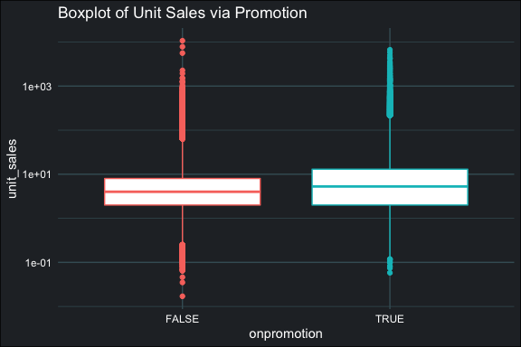
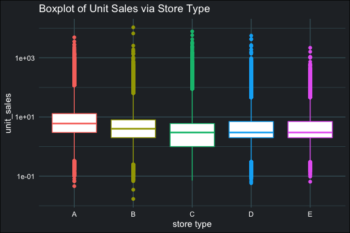

Grocery Sales Forecasting - Report
==================================

### Data Files

-   [`README.Rmd`](https://github.com/Jiaying-Wu/Grocery-Sales-Forecasting/blob/master/report/README.Rmd): R markdown to generate this data insight of Corporación Favorita Grocery Sales data.

Report
------

In order to speed up the visulization, this report only using 10% of our integrated training set, that is 2.3 millions records.

#### `unit_sales`

    ##      Min.   1st Qu.    Median      Mean   3rd Qu.      Max. 
    ##     0.017     2.000     4.000     8.179     8.000 10700.000

It suggested most of the item sold less than 10 units per supermarket per day.

#### `date`

The plot suggested strong seasonality in the total unit sale.

#### `store_nbr`: store id.

In general, the median unit sale of 54 store is similiar, the plot suggest `store_nbr` can explain some of variation in `unit_sales`. However, level merging of `store_nbr` might required.

#### `item_nbr`: item id.

    ## [1] 4000

That is 4000 different items, the item id should be consider as factor type, plot in numerical order only in visualization purpose. The plot suggested `item_nbr` can explain a lot varaition of `unit_sales`. However, level merging of `item_nbr` might required.

#### `onpromotion`: wether on promotion.

The plot suggested the unit sales will slightly increased while the item is on promotion.

#### `family`: item family.

    ## [1] 33

33 level in `family`, this variable explain lot of variation of `unit_sales`. Consider it is a fatcor variable, level might a bit too much. Since `family` is a feature related to item, we can integrated `family` and `item_nbr` to generate new features via clustering.

#### `class`: item class.

    ## [1] 331

That is 331 different item class. The item class should be consider as factor type, plot in numerical order only in visualization purpose. The plot suggested `class` can explain a lot varaition of `unit_sales`.

Since `class` is also a feature related to item, we can integrated `class`, `family` and `item_nbr` to generate new features via item clustering.

#### `perishable`: wether item is perishable.

In this plot, 1 mean the item is perishable and 0 is the contrast. The plot suggested the perishable item will have a higher sale in units.

#### `city`

The supermarket in city Quito have the highest mean unit sales comparing others.

    ## [1] 22

#### `state`

    ## [1] 16

That is 22 city in 16 state of this dataset, both of them explain some of the variation in `unit_sales`. However, some of the level share the similar mean in both varaible. Since the number of city only slightly smaller than the number of state, we can integrated `city` and `state` to generate new features.

#### `type`: store type.

The item in store type A have the higest mean unit sales and item in store type E have the lowest mean unit sales. The mean unit sale in each store type share the similar value, future level merging for `type` might required.

#### `cluster`: store cluster.

The plot suggested supermarket in cluster 5, 8, 11 and 14 have a higher mean unit sales than others. Since some of the cluster have the similar mean unit sale, future level merging for `type` might required.

#### `dcoilwtico`: oil price.

The plot suggested the mean unit sales is positive associated with the oil price.
